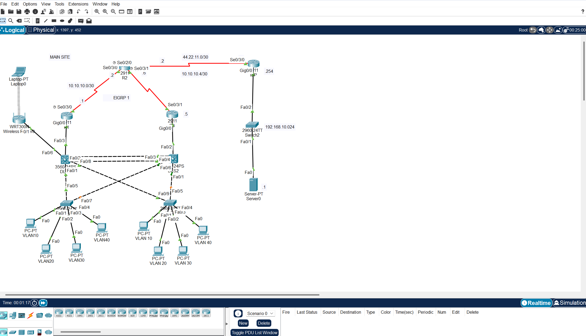

# Mon Calamari Enterprise Network

## Overview

This project is a Cisco Packet Tracer implementation of an enterprise network designed for Mon Calamari Enterprises.

The network was built using a layered architecture with redundancy, segmentation, dynamic routing and secure management services. The objective was to create a resilient business network capable of supporting multiple departments, wireless users, secure administration and fault-tolerant gateway services.

The project demonstrates practical experience with enterprise networking technologies including VLANs, VTP, EtherChannel, Rapid PVST+, inter-VLAN routing, EIGRP, HSRP, DHCP, DNS, wireless networking and SSH administration.

## Network Topology

## Technologies Used

* Cisco Packet Tracer
* VLANs
* VTP
* IEEE 802.1Q Trunking
* EtherChannel
* Rapid PVST+
* Router-on-a-Stick Inter-VLAN Routing
* EIGRP
* HSRP
* DHCP
* DNS
* Wireless Networking
* SSH
* Network Redundancy

## Network Design

The network was designed using a layered approach to improve scalability, resilience and manageability.

### VLAN Structure

| VLAN     | Purpose          |
| -------- | ---------------- |
| VLAN 10  | User Network     |
| VLAN 20  | User Network     |
| VLAN 30  | User Network     |
| VLAN 40  | User Network     |
| VLAN 100 | Management       |
| VLAN 200 | Wireless Network |

### Core Components

* Distribution Layer Switches
* Access Layer Switches
* Routers R1, R2 and R3
* Wireless Access Infrastructure
* DHCP Services
* DNS and Web Services
* Redundant Gateway Architecture

## Key Features

### VLAN Segmentation

The network was divided into multiple VLANs to improve traffic management, reduce broadcast domains and provide administrative separation between services.

### VTP

VTP was implemented to simplify VLAN management and ensure VLAN information was propagated consistently across switches.

### EtherChannel

EtherChannel was configured between distribution switches to increase bandwidth and provide link redundancy.

### Rapid PVST+

Rapid PVST+ was implemented to prevent switching loops and improve network convergence times.

### Inter-VLAN Routing

Router-on-a-stick routing was configured using IEEE 802.1Q subinterfaces to allow communication between VLANs.

### Dynamic Routing with EIGRP

EIGRP was deployed between R1, R2 and R3 to provide dynamic route learning and automatic route updates.

### Gateway Redundancy with HSRP

HSRP was implemented across multiple VLANs to provide fault tolerance and automatic failover of default gateway services.

### DHCP and DNS

DHCP services were configured to automate IP address assignment, while DNS and web services were deployed for network testing and validation.

### Secure Wireless Networking

A dedicated wireless VLAN was implemented using WPA2 security and controlled DHCP allocation.

### Secure Remote Administration

SSH was configured on routers and switches to provide encrypted administrative access.

## Testing and Validation

The network was tested to verify:

* VLAN connectivity
* Inter-VLAN communication
* DHCP address allocation
* EIGRP neighbour relationships
* HSRP failover and recovery
* SSH administrative access
* Wireless client connectivity
* DNS and web service accessibility

Testing confirmed successful operation of all major services within the enterprise network design.

## Skills Demonstrated

This project demonstrates practical experience with:

* Enterprise network design
* VLAN implementation
* Switching technologies
* Dynamic routing
* Gateway redundancy
* Network security
* DHCP and DNS services
* Wireless networking
* SSH administration
* Cisco Packet Tracer
* Network troubleshooting

## Project Files

* `MonCalamari_EnterpriseNetwork.pkt`
* `MonCalamari_EnterpriseNetwork_Report.pdf`

## What I Learned

This project strengthened my understanding of enterprise networking concepts including redundancy, dynamic routing, segmentation and secure administration. It also provided practical experience implementing and testing technologies commonly used in business environments, while improving my troubleshooting and network design skills.
